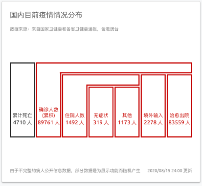
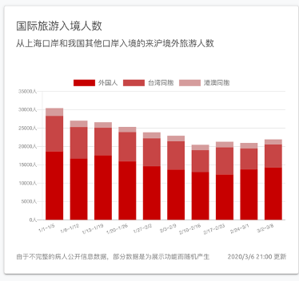
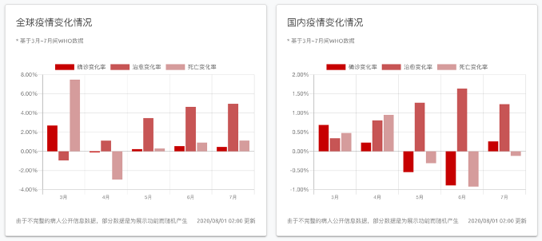
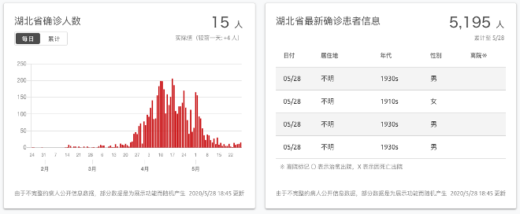

# Covid-19 疫情分析与管理系统

<center>Covid-19 Analysis & Manage System</center>


## 简介

本项目作为数据库系统课程 2020 期末项目具有全球疫情可视化概览、病人诊断数据统计及编辑、诊断医院和医生管理等功能。

目前，项目已部署至 [https://covid19.billc.io](https://covid19.billc.io)，并开发过程中使用 GitHub 来管理版本。

在 https://github.com/billchen2k/Covid19 可以获取到项目的源代码，通过 commit 记录可回顾本项目的开发进度。

### 首页

首页具有病人接诊卡片，指引用户界面友好的病人接诊指南，引导病人指引核酸、到相应的医疗机构就诊。

### 疫情概览

利用来自 WHO 每日疫情简报和丁香园的新冠肺炎疫情公开数据，绘制可视化的图表。展示了全球疫情较严重地区的确诊情况，包括中国、英国、日本、巴西、俄罗斯、意大利的可视化数据。我们还展示了国内目前疫情情况分布（分为了累计死亡、确诊人数、住院人数、无症状感染者、境外输入和治愈出院人数等），国际旅游入境人数、全球疫情变化情况、国内疫情变化情况、湖北省确诊人数、湖北省最新确诊患者信息等可视化数据，全方位地展示疫情的发展情况。

  

#### 国内疫情人数情况

通过静态的数据显示国内真实的疫情人数情况，针对当前全新的防疫状况，增设无症状感染者一栏。同时通过形状的弯曲来表示包含关系，形式简约大方，又不失美感。



#### 国际旅游入境人数统计

通过可视化的比较通过疫情爆发前后，入境人数的变化。同时增设隐藏对应“外国人”、“台湾同胞”、“港澳同胞”数据的按钮，且会根据隐藏动态的调整纵坐标，已经根据比例动态缩放对应柱形图



#### 国际/国内疫情变化

通过可视化的比较疫情爆发几个月国际和国内的增长幅度变化。同时增设隐藏对应选项数据的按钮，且会根据隐藏动态的调整纵坐标，已经根据比例动态缩放对应柱形，增长向上、降低向下，更加清晰。



#### 最新确诊病人情况

数据与数据库匹配，动态展示。在前端，对数据进行了一定的处理展示（例如隐去姓名，模糊出生日期），在前端通过数据处理，显示当前新增病例以及较前一天的变化情况，同时通过数据处理展示累计情况。最新确诊患者信息可以对相应的列按照一定顺序排序。



### 病患查询

为了展示该模块的功能，受限于有限的公开展示数据，我们利用脚本结合真实数据虚构了数十万条合理的数据，并实时更新。

该模块可以查询到数据库内的十四万条病患信息（和中国真实的感染人数相对应），且可以展开详细信息进行查看。用户也可以根据病情、性别、发病日期、姓名、发病地点等条件对病患进行筛选。


展开详细信息可以查看到数据库中和该病患相关的所有数据。除了基础个人档案之外，还有处方与诊断记录的查看。处方信息包括了药品名称、用法用量及制药厂；诊断记录包括了诊断时间、治疗医师、体温、核酸检测情况和症状描述。同时，我们也对诊断记录中的体温一项制作了可视化的体温曲线，能够更加直观地得到用户的就诊情况。


这里使用的数据同样基于真实数据由脚本生成，但病患的数量是根据丁香园每日新增、死亡和治愈的真实数据产生。

#### 病患登记

用户可以在该模块快速登进新的病人。在完整填写所有信息之后也可以快速展开该病人的详细信息，进行诊断和处方登记等操作。


### 病患管理

该模块具有和病患查询一样的检索列表，但开放了编辑权限。医生可以为患者登记 / 删除诊断记录、新增 / 删除处方信息，及修改患者的所有个人信息，包括医院、医生、生日、性别、治愈情况等。仅有已登录的用户可以访问本页面并对病患进行修改。


新增诊断：


新增处方：


为了方便医生登记患者情况，处方和诊断的新建页面均提供了快速输入模板，提供了一些常用的登记模板。

#### 关于

含有项目信息、数据库 ER 图、作者信息等声明。

### 技术架构

#### Frontend

主要文件目录：

```
frontend
├── README.md
├── assets
│   ├── README.md
│   ├── global.scss
│   └── variables.scss
├── components
│   ├── AgencyBarChart.vue
│   ├── ConfirmedCasesTable.vue
│   ├── DataSelector.vue
│   ├── DataTable.vue
│   ├── DataView.vue
│   ├── DataViewBasicInfoPanel.vue
│   ├── DesktopFlowSvg.vue
│   ├── LanguageSelector.vue
│   ├── ListItem.vue
│   ├── MetroBarChart.vue
│   ├── MonitoringConsultationDeskReportChart.vue
│   ├── NumberDisplay.vue
│   ├── OpenDataLink.vue
│   ├── PageHeader.vue
│   ├── PrinterButton.vue
│   ├── README.md
│   ├── SideNavigation.vue
│   ├── StaticInfo.vue
│   ├── SvgCard.vue
│   ├── TestedCasesDetailsTable.vue
│   ├── TextCard.vue
│   ├── TimeBarChart.vue
│   ├── TimeStackedBarChart.vue
│   ├── WhatsNew.vue
│   ├── cards
│   │   └── PositiveRateCard.vue
│   ├── flow
│   │   ├── FlowPc.vue
│   │   ├── FlowPcAdvisory.vue
│   │   ├── FlowPcDays.vue
│   │   ├── FlowPcHospitalized.vue
│   │   ├── FlowPcNotRequired.vue
│   │   ├── FlowPcPast.vue
│   │   ├── FlowPcPcr.vue
│   │   ├── FlowPcRequired.vue
│   │   ├── FlowPcSuspect.vue
│   │   ├── FlowSp.vue
│   │   ├── FlowSpAccording.vue
│   │   ├── FlowSpAdvisory.vue
│   │   ├── FlowSpElder.vue
│   │   ├── FlowSpGeneral.vue
│   │   ├── FlowSpHospitalized.vue
│   │   ├── FlowSpPast.vue
│   │   └── FlowSpSuspect.vue
│   ├── global
│   │   ├── Config.vue
│   │   └── EventBus.js
│   ├── patient
│   │   ├── DiagnosisCard.vue
│   │   ├── PatientDetail.vue
│   │   ├── PrescriptionCard.vue
│   │   └── TemperatureChart.vue
│   └── picker
│       ├── DatePicker.vue
│       ├── DateTimePicker.vue
│       ├── DiagnosisCreator.vue
│       ├── HospitalDoctorPicker.vue
│       ├── MedicinePicker.vue
│       └── PrescriptionCreator.vue
├── data
│   ├── agency.json
│   ├── data.json
│   ├── metro.json
│   ├── metroChina.json
│   └── news.json
├── layouts
│   ├── README.md
│   ├── default.vue
│   ├── error.vue
│   └── print.vue
├── netlify.toml
├── nuxt.config.ts
├── package.json
├── pages
│   ├── README.md
│   ├── about.vue
│   ├── checkin.vue
│   ├── flow.vue
│   ├── index.vue
│   ├── login.vue
│   ├── logout.vue
│   ├── manage.vue
│   ├── print
│   │   └── flow.vue
│   ├── query.vue
│   ├── report.vue
│   ├── statistics.vue
│   └── worker.vue
├── plugins
│   ├── axe.ts
│   ├── chartjs-adapter-dayjs.ts
│   ├── vue-chart.ts
│   └── vuetify.ts
├── static
│   ├── apple-touch-icon-precomposed.png
│   ├── confirmed-cases-table.svg
│   ├── covid.svg
│   ├── data
│   │   └── 130001_tokyo_covid19_patients.csv
│   ├── er.png
│   ├── facebook.png
│   ├── favicon.ico
│   ├── flow.png
│   ├── flow_sp.png
│   ├── github.png
│   ├── icon.png
│   ├── line.png
│   ├── logo.svg
│   ├── ogp.png
│   ├── parent.svg
│   ├── selectmenu.svg
│   ├── site-qr.svg
│   ├── sw.js
│   └── twitter.png
├── tsconfig.json
├── utils
│   ├── colors.ts
│   ├── formatConfirmedCases.ts
│   ├── formatDate.ts
│   ├── formatGraph.ts
│   └── formatTable.ts
└── yarn.lock
```

网站前端采用 `vue.js` 架构，整个项目使用组件化的设计规范编写，并使用了 `nuxt` 实现高性能的 SSR （服务端渲染）。使用 `vuex` 来实现全局路由，通过 nuxt-ts 将项目中的所有路由生成为静态的文件托管在服务器上。

项目使用 `vuetify` 作为主要的 UI 库，实现了现代化的遵循 Material Design 设计风格规范的交互界面。使用了  Google Font API，将 `Ubuntu` 字体注入进项目。

使用 `axios` 来实现和后端的异步请求，使用 `chart.js` 来绘制项目中使用的可视化图表。在开发过程中还使用到 `date-fns`、`mdi-icons`、`vue-spinner`等 depencency。用户的认证信息存储在浏览器的本地 cookie 中，同时使用了 sessionid 来后端作为请求凭据，双重认证用户身份，确保没有登录的用户不能对病患做出非法修改。

#### Backend & Database

后端使用经典的 Java 框架 SpringBoot 编写。主要文件结构图：

```
backend
├── BackendApplication.java
├── config
│   ├── ErrorEnums.java
│   ├── GlobalCorsConfig.java
│   ├── SwaggerConfig.java
│   └── WebConfig.java
├── controller
│   ├── BaseController.java
│   ├── GlobalExceptionHandler.java
│   ├── IndexController.java
│   ├── account
│   │   ├── GetUserInfo.java
│   │   ├── LogIn.java
│   │   ├── LogOut.java
│   │   ├── SignUp.java
│   │   └── UpdateUserInfo.java
│   ├── diagnosis
│   │   ├── CreateDiagnosis.java
│   │   ├── DeleteDiagnosis.java
│   │   ├── GetDiagnosisInfo.java
│   │   └── UpdateDiagnosis.java
│   ├── doctor
│   │   ├── CreateDoctor.java
│   │   ├── DeleteDoctor.java
│   │   ├── GetDoctorInfo.java
│   │   └── UpdateDoctor.java
│   ├── hospital
│   │   ├── CreateHospital.java
│   │   ├── DeleteHospital.java
│   │   ├── GetHospitalInfo.java
│   │   └── UpdateHospital.java
│   ├── image
│   │   ├── CreateImage.java
│   │   ├── DeleteImage.java
│   │   ├── GetImageInfo.java
│   │   └── UpdateImage.java
│   ├── medicine
│   │   ├── CreateMedicine.java
│   │   ├── DeleteMedicine.java
│   │   ├── GetMedicineInfo.java
│   │   └── UpdateMedicine.java
│   ├── patient
│   │   ├── CreatePatient.java
│   │   ├── DeletePatient.java
│   │   ├── GetPatientInfo.java
│   │   └── UpdatePatient.java
│   └── prescription
│       ├── CreatePrescription.java
│       ├── DeletePrescription.java
│       ├── GetPrescriptionInfo.java
│       └── UpdatePrescription.java
├── dao
│   ├── DiagnosisMapper.java
│   ├── DoctorMapper.java
│   ├── HospitalMapper.java
│   ├── ImageMapper.java
│   ├── MedicineMapper.java
│   ├── PatientMapper.java
│   ├── PrescriptionMapper.java
│   └── UserMapper.java
├── model
│   ├── Diagnosis.java
│   ├── Doctor.java
│   ├── Hospital.java
│   ├── Image.java
│   ├── Medicine.java
│   ├── Patient.java
│   ├── Prescription.java
│   ├── Result.java
│   └── User.java
├── service
│   ├── BaseService.java
│   ├── account
│   │   ├── GetUserInfoService.java
│   │   ├── LogInService.java
│   │   ├── LogOutService.java
│   │   ├── SignUpService.java
│   │   └── UpdateUserInfoService.java
│   ├── diagnosis
│   │   ├── CreateDiagnosisService.java
│   │   ├── DeleteDiagnosisService.java
│   │   ├── GetDiagnosisInfoService.java
│   │   └── UpdateDiagnosisService.java
│   ├── doctor
│   │   ├── CreateDoctorService.java
│   │   ├── DeleteDoctorService.java
│   │   ├── GetDoctorInfoService.java
│   │   └── UpdateDoctorService.java
│   ├── hospital
│   │   ├── CreateHospitalService.java
│   │   ├── DeleteHospitalService.java
│   │   ├── GetHospitalInfoService.java
│   │   └── UpdateHospitalService.java
│   ├── image
│   │   ├── CreateImageService.java
│   │   ├── DeleteImageService.java
│   │   ├── GetImageInfoService.java
│   │   └── UpdateImageService.java
│   ├── medicine
│   │   ├── CreateMedicineService.java
│   │   ├── DeleteMedicineService.java
│   │   ├── GetMedicineInfoService.java
│   │   └── UpdateMedicineService.java
│   ├── patient
│   │   ├── CreatePatientService.java
│   │   ├── DeletePatientService.java
│   │   ├── GetPatientInfoService.java
│   │   └── UpdatePatientService.java
│   └── prescription
│       ├── CreatePrescriptionService.java
│       ├── DeletePrescriptionService.java
│       ├── GetPrescriptionInfoService.java
│       └── UpdatePrescriptionService.java
└── utils
    ├── Authentication.java
    ├── Encrypt.java
    ├── ScheduledTask.java
    └── Utils.java
```

项目主要使用了 Controller - Service - Mapper - Model 四层架构，结构清晰，易于维护。加入了全局日志记录，滚动式记录到 log 文件夹，配置了全局错误处理 `GlobalExceptionHandler`，便于调试开发中出现的问题。

项目使用 `maven` 来管理依赖。使用 `Swagger UI` 生成易于阅读和调试的 API 文档，使用基于注解的 `MyBatis` 构建 dao 层的 Mapper，映射数据库的查询关系，使用 `Lombok` 来更加方便地生成 Model 内的 setter、getter 等方法，快速完成 bean 的编写，使用 `pagehelper` 来实现 Controller 返回结果的分页。同时配置了同源策略，确保了安全性。

项目配置了全局的返回类 `Result`，确保了返回格式的统一。所有接口的统一返回格式如下：

```json
{
	"code": 200, 		// 返回代码
	"data": [],			// 返回数据
	"message": "",		// 返回的消息
	"requestid": "",	// 请求 ID
	"success": true,	// 是否成功
	"timestamp": "",	// 请求时间戳
	"totalCount": ""	// 数据总数 （仅在分页时适用）
}
```

 数据库采用 MySQL Community Version 8.0.12, 存有两万余医生数据，十三万患者数据，四十万余条处方数据，近四百万余条诊断记录。经过多重索引和外键优化，平均性能仍较优秀。详细的数据库架构及简介参见：[数据库结构文档 - database.md](database.md)

#### Script

为了给数据库中填入初始数据，需要生成一些列的演示数据。使用 Python 中的 `faker` 库来生成虚假的个人信息，基于丁香园的疫情真实数据来生成医院、医生数据。使用 `request` 库持续向后端发送批量请求，来完成数据库的初始化。生成的数据中，具有的几种诊断模板为：

```python
diagnosis = [
    {
        "temp": random.randint(360, 370) / 10,
        "words": "病情稳定，情况良好。",
        "dna": 0
    },
    {
        "temp": random.randint(370, 380) / 10,
        "words": "轻微发烧症状，呼吸略有困难，需要进一步确定情况。",
        "dna": 0
    },
    {
        "temp": random.randint(370, 380) / 10,
        "words": "已确诊为新冠肺炎，病状较轻，应注意控制以避免病情恶化。",
        "dna": 1
    },
    {
        "temp": random.randint(370, 380) / 10,
        "words": "呼吸略有困难，应当辅助药物治疗，并保证已经被隔离。",
        "dna": 1
    },
    {
        "temp": random.randint(380, 390) / 10,
        "words": "温度较高，应特别关注病情，有突发情况及时处理。",
        "dna": 1
    },
    {
        "temp": random.randint(380, 390) / 10,
        "words": "温度较高，但核酸检测阴性，目前应当按照普通流感和肺炎治疗处理，并考虑再次核酸检测避免误诊。",
        "dna": 0
    },
    {
        "temp": random.randint(390, 395) / 10,
        "words": "状态很危险，应辅助呼吸治疗，必要时转入重点监护病房。",
        "dna": 1
    },
    {
        "temp": random.randint(395, 412) / 10,
        "words": "状态极其危险，应作为重点监护对象，保持密切关注，辅助生命维持设备。",
        "dna": 1
    },
]
```


## 更多文档

[API 文档 - api.md](api.md) （或在 [http://8.210.248.203/docs.html](http://8.210.248.203/docs.html) 查看在线版本）

[数据库结构文档 - database.md](database.md)

[需求文档 - demands.md](demands.md) 

[部署指南 - deployment.md](deployment.md)

## 特别鸣谢

本项目的前端部分参考了基于 MIT 协议的开源项目 [「東京都 新型コロナウイルス感染症対策サイト」 ](https://github.com/tokyo-metropolitan-gov/covid19)。原项目仅仅提供了日本疫情数据的一些可视化的曲线展示，我们在该项目的基础上针对中国的疫情数据进行了大幅修改，并添加了后端，实现了与后端的对接。实现了针对每个具体病人的详细信息的增删改查、处方、诊断记录等的检索与修改功能，以及针对医生和医院能否对病患进行增删改的用户权限系统。

国内疫情数据主要来源为丁香园每日疫情统计数据。国际疫情数据主要来源为 WHO 每日疫情公告。

## Credit

| 姓名   | 学号        | 联系方式                                                    | 主要分工               |
| ------ | ----------- | ----------------------------------------------------------- | ---------------------- |
| 陈俊潼 | 10185101210 | [Bill.Chen@live.com](mailto:Bill.Chen@live.com)             | 前端、后端、脚本       |
| 包梁   | 10185101281 | [964131617@qq.com](mailto:964131617@qq.com)                 | 后端、数据库设计、文档 |
| 谢嘉东 | 10185101247 | [xiejiadong0623@gmail.com](mailto:xiejiadong0623@gmail.com) | 前端、数据库设计、文档 |

---

East China Normal University

2020.8